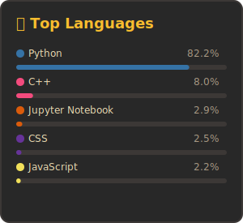
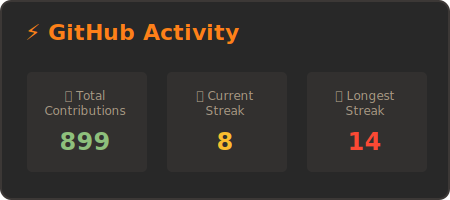

## Hi there 👋
I'm Abdur Rafay — professional bug creator, part-time bug fixer.🐛🔧  
I write code, drink coffee, and occasionally make something that actually works.

Feel free to browse my repos…  
some of them even run without crashing. 😎

## 💻 Languages I Use

## ✴️Cool Stuff I Use

## 📊 GitHub Stats:

  
  &nbsp;&nbsp;&nbsp;&nbsp;
  

