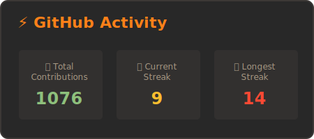

<h1 align="center">Abdur Rafay</h1>
<h3 align="center">AI/ML Engineer building production-grade agentic systems</h3>

  RAG pipelines, multi-agent systems, and voice AI in production

  
  
  

---

### Background

AI/ML engineer pursuing a Bachelor's in Artificial Intelligence. Shipped 25+ production AI systems spanning RAG pipelines, multi-agent orchestration, and voice agents, backed by six internships across international teams. Open to select freelance or contract work.

---

### Stack

**Languages & Core**

**AI / ML**

**Backend & Infra**

---

### [Certifications](https://www.credly.com/users/abdur-rafay.658ecb38)

IBM AI Developer Professional Certificate · Generative AI with Large Language Models (AWS) · Supervised Machine Learning (Stanford)

<!-- CREDLY-BADGES:START -->
<!-- CREDLY-BADGES:END -->

---

### Featured work

| Project | What it does | Stack |
|---|---|---|
| **[ai-cache](https://github.com/Abdur-Rafay-AR/ai-cache)** | Automatic caching layer for LLM API responses across OpenAI, Gemini, and Anthropic | Python, LLM APIs |
| **[resume-ai-system](https://github.com/Abdur-Rafay-AR/resume-ai-system)** | AI-powered resume analysis system, deployed and Groq-backed | Python, Groq, LLMs |
| **[domain-market-analyzer](https://github.com/Abdur-Rafay-AR/domain-market-analyzer)** | Scraper and analyzer for Australian real estate market data | Python, web scraping |
| **[bahria-LMS-assignment-checker](https://github.com/Abdur-Rafay-AR/bahria-LMS-assignment-checker)** | Automation tool that monitors and checks LMS assignments | Python |

---

## 📊 GitHub Stats:

  
  &nbsp;&nbsp;&nbsp;&nbsp;
  

